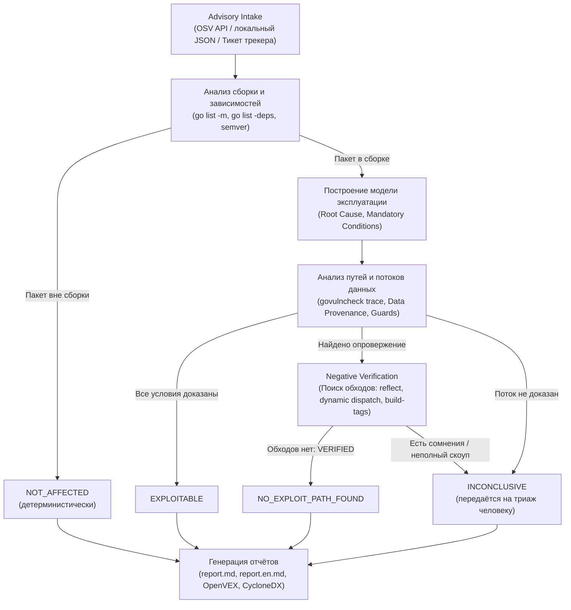

# Vuln Analyzer

Промышленный статический анализатор эксплуатируемости уязвимостей для экосистемы **Go**. Анализатор исследует применимость конкретной advisory (CVE / GO / GHSA) к конкретному снимку (snapshot) кодовой базы продукта, отсекает ложные срабатывания SCA-сканеров с математической строгостью компилятора Go и формирует воспроизводимое аудируемое обоснование.

---

## 1. Зачем нужен Vuln Analyzer (Ценность для AppSec и разработки)

Стандартные сканеры зависимостей (SCA: `govulncheck`, `trivy`, `snyk`) бьют тревогу при любом совпадении уязвимой версии в `go.mod`. Даже продвинутые инструменты анализа достижимости (call graph) выдают красные алерты, если функция вызывается, не понимая:
* передаются ли в уязвимый метод внешние данные от атакующего или жестко заданные константы;
* слинкован ли реальный дефектный код или только вспомогательные диспетчеры и проверки;
* защищен ли вызов проверками (guards) и читаются ли данные из доверенной инфраструктуры хоста.

В результате команды безопасности и разработки тратят сотни часов на ручной триаж заведомо неэксплуатируемых уязвимостей или экстренно бэкпортируют обновления зависимостей в релизные ветки.

**Vuln Analyzer решает эту проблему**:
* **53% ложных алертов снимаются автоматически** (20 из 38 кейсов на реальном [live-бенчмарке](eval/README.md));
* **35% signal-cleared**: безопасное опровержение шумных алертов `govulncheck` (`REACHABLE` / `package-level`);
* **Строгий инвариант `false-safe = 0`**: ни одного ложно-безопасного вердикта. Если безопасность нельзя математически строго доказать, уязвимость никогда не закрывается автоматически.

---

## 2. Архитектура и гарантии для службы информационной безопасности

Безопасность и аудируемость результатов анализа опираются на строгие формальные контракты.

### 2.1. Фундаментальный принцип: Презумпция опасности
> **Отсутствие найденного пути эксплуатации не доказывает его отсутствие.**

Анализатор никогда не выдает вердикт «не эксплуатируется» только потому, что статический анализ или нейросеть «ничего не нашли». Для отрицательного вердикта система обязана найти и строго доказать **фальсификатор (Falsifier)** — факт того, что хотя бы одно обязательное условие эксплуатации физически невозможно.

### 2.2. Система 4 терминальных вердиктов

| Вердикт | Значение | Требования к доказательству |
|---|---|---|
| 🟢 **`NOT_AFFECTED`** | Уязвимый код физически не скомпилирован в продукт | Детерминистически доказано: пакет отсутствует в графе сборки (`go list -deps`) или версия вне диапазона advisory. |
| 🟢 **`NO_EXPLOIT_PATH_FOUND`** | Код скомпилирован, но условия эксплуатации невыполнимы | Опровергнуто обязательное условие (`Falsifier`) и пройдена фаза **Negative Verification** (проверено отсутствие обходных путей через рефлексию, интерфейсы и динамические маркеры). |
| 🔴 **`EXPLOITABLE`** | Уязвимость подтверждена на внешних путях | Доказана полная цепочка: недоверенный сетевой ввод достигает локуса дефекта без сдерживающих проверок. |
| 🟡 **`INCONCLUSIVE`** | Недостаточно данных для строгого доказательства | Неразрешимые динамические вызовы, зависимость от внешнего деплоя или неполнота спецификации. **Требует ручного триажа человеком**. |

### 2.3. Детерминизм компилятора против LLM (AI Governance)
* **Детерминистические проверки авторитетнее LLM**. Весь анализ сборки, типов, синтаксических деревьев (AST), графа вызовов и происхождения данных (`data provenance`) выполняется строгим Go-кодом.
* **LLM генерирует только структурированные предложения** (гипотезы, выделение вероятных мест дефекта, семантический разбор patch-diff). Ни одна LLM-гипотеза не может повлиять на вердикт без независимой детерминистической верификации.
* **Режим `--deterministic-only`**: позволяет полностью отключить вызовы нейросетей для изолированных или закрытых контуров сборки.

### 2.4. Специализированные защитные механизмы (Safety Gates)
1. **Missing-Call Gate**: защита от ложного снятия уязвимостей, где дефект заключается в **отсутствии обязательной проверки** (например, CVE-2020-26160 в `jwt-go`, где валидация `VerifyAudience` не вызывается библиотекой). Факт отсутствия вызова блокирует отрицательный вывод и честно удерживает статус `INCONCLUSIVE`.
2. **Изоляция константного ввода (Constant Ingress)**: если входные данные парсера (JSON/YAML/Protobuf) доказаны как compile-time константы (`const`), внутренняя рефлексия парсера по выходным структурам изолируется и не сбрасывает доказанную безопасность входного пейлоада.
3. **Разделение сайта дефекта и транспорта (Locus Separation)**: разделяет функции, где реально происходит сбой/паника, и вспомогательный транспортный код, на котором ошибочно шумит `govulncheck`.

### 2.5. Аудит, воспроизводимость и экспорт
* По каждому анализу сохраняется сериализованный снимок `AnalysisCase` со списком всех выполненных вызовов (`tool_executions`: имя утилиты, аргументы, код возврата, SHA-256 вывода).
* Автоматическая генерация машиночитаемых стандартов: **OpenVEX** (`openvex.json`), **CycloneDX VEX** и `report.json` для встраивания в CI/CD Security Gates.

---

## 3. Как устроен анализ (Конвейер)



---

## 4. Подробная инструкция по использованию (CLI)

### 4.1. Установка и сборка

```bash
git clone https://github.com/example/vuln-analyzer.git
cd vuln-analyzer
go build -o vuln-analyzer ./cmd/analyzer
```

### 4.2. Основные команды

#### 1. `analyze` — полный анализ конкретной уязвимости
Анализирует применимость и эксплуатируемость одной advisory для репозитория продукта:

```bash
# Базовый запуск по ID из базы OSV (GO-..., CVE-..., GHSA-...)
vuln-analyzer analyze --repo /path/to/project --vuln GO-2025-3595

# Анализ с автономным AI-исследованием механизма CVE и patch-diff
vuln-analyzer analyze --repo /path/to/project --vuln GO-2026-6443 --cve-analysis assist

# Анализ с ручной загрузкой локального advisory JSON (без интернета)
vuln-analyzer analyze --repo /path/to/project --vuln-file advisory.json

# Анализ из внешнего тикета трекера задач
vuln-analyzer analyze --ticket ticket.json
```

#### 2. `scan` — пакетное сканирование зависимостей репозитория
Сканирует все зависимости проекта через OSV API, отсекает неприменимые версии и выполняет глубокий анализ потенциально опасных:

```bash
vuln-analyzer scan --repo /path/to/project --max-vulns 50
```
Результаты сохраняются в `.vuln-analyzer/scan.json`.

#### 3. `remediate` — планирование и применение исправлений
Рассчитывает минимально необходимое обновление зависимостей (`go get`), проверяет совместимость и автоматически перепроверяет проект:

```bash
# Режим планирования (dry-run, вывод команды без изменения файлов)
vuln-analyzer remediate --repo /path/to/project --vuln GO-2025-3595

# Автоматическое применение исправления с прогоном тестов
vuln-analyzer remediate --repo /path/to/project --vuln GO-2025-3595 --apply --run-tests

# Безопасное применение в изолированном git worktree
vuln-analyzer remediate --repo /path/to/project --vuln GO-2025-3595 --apply --worktree /tmp/fix-wt
```

#### 4. `eval` — регрессионный тестовый корпус и бенчмарк
Запуск эталонного набора уязвимостей для валидации точности работы анализатора:

```bash
# Параллельный запуск всех 38 кейсов корпуса (быстро, с кэшированием)
vuln-analyzer eval --corpus eval/corpus-real.json -j 4

# Запуск одного конкретного кейса за 5-9 секунд
vuln-analyzer eval --corpus eval/corpus-real.json --case real-jwt-auth
```

#### 5. `knowledge` — управление базой знаний экосистемы
Выводит эффективную базу знаний (семантика стандартных и сторонних библиотек, источники данных, санитизаторы):

```bash
vuln-analyzer knowledge
vuln-analyzer knowledge --knowledge custom-rules.json
```

---

### 4.3. Справочник опций и параметров

| Группа | Флаг | Тип / Значения | Описание |
|---|---|---|---|
| **Входные данные** | `--repo <path>` | путь | Путь к корню Go-репозитория продукта (обязателен для `analyze`/`scan`) |
| | `--vuln <id>` | строка | Идентификатор уязвимости (`GO-...`, `CVE-...`, `GHSA-...`) |
| | `--vuln-file <path>` | путь | Путь к локальному OSV JSON файлу (офлайн-режим) |
| | `--ticket <path>` | путь | Generic JSON-тикет трекера с метаданными задачи |
| **Параметры сборки** | `--goos`, `--goarch` | строка | Целевая ОС и архитектура (по умолчанию текущая система) |
| | `--build-tags <tags>` | строка | Go build tags через запятую (например, `netgo,osusergo`) |
| | `--binary <path>` | путь | Путь к скомпилированному релизному бинарнику (чтение встроенного build info) |
| **AI и LLM** | `--cve-analysis <mode>` | `off`, `assist`, `verified` | Режим работы AI-исследователя CVE (по умолчанию `off`) |
| | `--strict-llm` | флаг | Режим fail-fast: падать с ошибкой при сбое LLM, не переключаясь на детерминистику |
| | `--deterministic-only`| флаг | Полное отключение всех нейросетевых компонентов |
| **Управление локусом** | `--accept-locus-proposals`| флаг | Автоматически принимать рекомендации об исключении вспомогательного кода транспорта |
| | `--non-locus-basis <file>`| путь | Экспертный JSON-файл исключения символов из сайтов дефекта |
| **Форматирование** | `--lang <ru\|en>` | `ru`, `en` | Язык вывода и отчетов (по умолчанию `ru`) |
| | `--case-dir <path>` | путь | Каталог для сохранения артефактов (по умолчанию `.vuln-analyzer`) |
| **Производительность**| `-j <n>` | число | Количество параллельных воркеров для `eval` (по умолчанию 4) |
| | `--mem-limit <size>` | размер | Лимит оперативной памяти с watchdog (например, `4GiB`) |

---

### 4.4. Настройка LLM-окружения

LLM-слой анализатора совместим с любым **OpenAI-compatible API** (корпоративный AI Gateway, vLLM, Ollama, OpenAI, Azure).

Настройка выполняется через переменные окружения или локальный файл `.env` в корне проекта:

```dotenv
# Включение LLM-слоя
LLM_ENABLED=1

# Адрес API и ключ
LLM_BASE_URL=https://api.openai.com/v1
LLM_API_KEY=sk-...

# Модели
LLM_ANALYZE_MODEL=gpt-4o
LLM_BUILD_MODEL=gpt-4o

# Таймауты и безопасность
LLM_TIMEOUT_SEC=120
LLM_MAX_TOKENS=4000
# LLM_INSECURE_TLS=1 # раскомментировать только для локальных тестовых self-signed сертификатов
```

> **Безопасность данных**: анализатор отправляет в LLM только фрагменты кода, относящиеся к уязвимости, и diff патчей. Файл `.env` по умолчанию внесен в `.gitignore` и не попадает в систему контроля версий.

---

## 5. Выходные артефакты

По результатам анализа в каталоге `--case-dir/<case-id>/` создаются готовые документы:

* **`report.md`** (русский) и **`report.en.md`** (английский): структурированные отчёты по принципу «Перевёрнутой пирамиды».
  * **Секция `## Резюме`**: готовый связный текст на русском языке для вставки в Jira/GitLab/трекер задач (подтверждение версии, статус сборки, суть дефекта, обоснование безопасности и остаточный риск).
  * **Таблица обязательных условий**: детальный аудит проверок с указанием компиляторного происхождения фактов.
* **`openvex.json`**: стандартизированный машинночитаемый документ VEX (Vulnerability Exploitability eXchange) со статусами `not_affected`, `affected`, `under_investigation`.
* **`cyclonedx.json`**: VEX-расширение в формате CycloneDX.
* **`report.json`**: полный JSON-дамп досье со всеми доказательствами и ограничениями.

---

## 6. Карта документации

### Для пользователей и специалистов AppSec
* [`docs/cli.md`](docs/cli.md) — полный подробный справочник команд, флагов и форматов входа.
* [`docs/how-it-works.md`](docs/how-it-works.md) — подробная методология: почему одного `govulncheck` недостаточно и как устроен анализ условий.
* [`docs/goals-scope.md`](docs/goals-scope.md) — цели, рамки проекта и продуктовые границы.
* [`eval/README.md`](eval/README.md) — результаты тестирования на live-бенчмарке (38 реальных уязвимостей, baseline-таблица).

### Для разработчиков и архитекторов
* [`docs/architecture.md`](docs/architecture.md) — архитектурные решения, модель данных и стейт-машина анализа.
* [`docs/dev/specs/governing-spec.md`](docs/dev/specs/governing-spec.md) — главная нормативная спецификация системы.
* [`docs/dev/decisions/architecture-decisions.md`](docs/dev/decisions/architecture-decisions.md) — архитектурные решения и запреты (ADR).
* [`docs/dev/current/gap-analysis.md`](docs/dev/current/gap-analysis.md) — канонический рабочий бэклог и статус задач.
* [`AGENTS.md`](AGENTS.md) — правила разработки и контрибьюции в репозиторий.

---

## Лицензия

MIT — см. [`LICENSE`](LICENSE).
