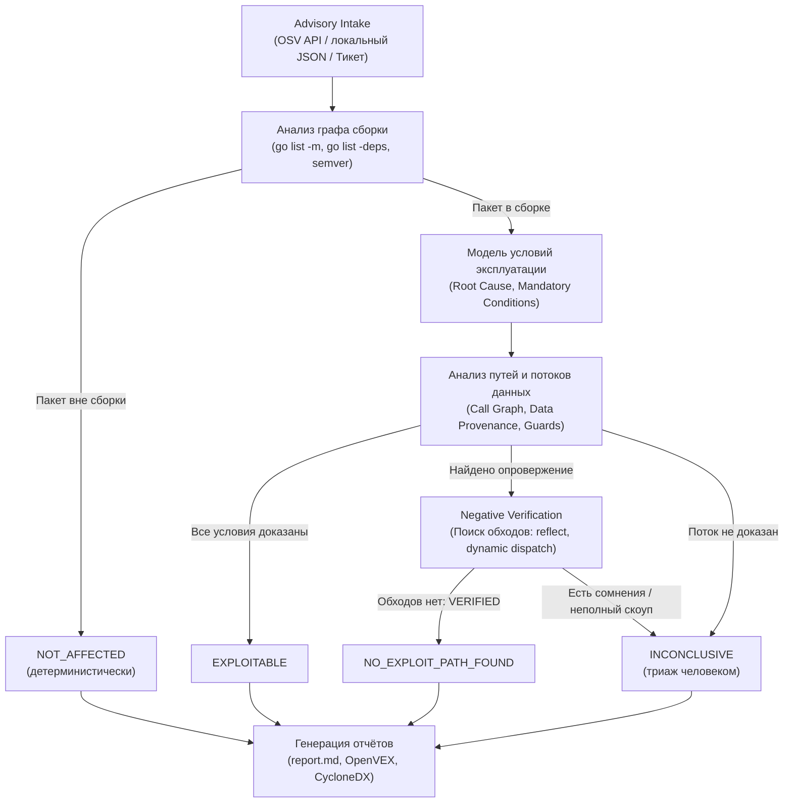

# Vuln Analyzer

Промышленный статический анализатор эксплуатируемости уязвимостей для экосистемы **Go**. Анализатор определяет применимость конкретной advisory (CVE / GO / GHSA) к конкретному снимку (snapshot) кодовой базы продукта, отсекает ложные срабатывания SCA-сканеров с математической строгостью компилятора Go и формирует воспроизводимое аудируемое обоснование.

---

## Ключевая ценность

Стандартные сканеры зависимостей (`govulncheck`, `trivy`, `snyk`) бьют тревогу при любом совпадении уязвимой библиотеки в `go.mod` или при наличии вызова функции в графе вызовов, не учитывая происхождение данных (константа или сеть) и наличие сдерживающих проверок (guards). Это порождает сотни часов бесполезного ручного триажа.

**Vuln Analyzer автоматизирует анализ с гарантией безопасности**:
* **53% ложных алертов снимаются автоматически** (20 из 38 кейсов на эталонном [live-бенчмарке](eval/README.md));
* **35% signal-cleared**: безопасное снятие шумных алертов `govulncheck` (`REACHABLE` / `package-level`);
* **Строгий инвариант `false-safe = 0`**: ни одного ложно-безопасного вердикта. Отрицательный вердикт выносится только при математически строгом доказательстве невыполнимости условий атаки.

---

## Главные инварианты и система вердиктов

> **Отсутствие найденного пути эксплуатации не доказывает его отсутствие.**
> Система никогда не объявляет уязвимость безопасной только потому, что «ничего не нашла». Для безопасного вердикта требуется доказанный **фальсификатор (Falsifier)** обязательного условия атаки.

| Вердикт | Статус | Требования к доказательству |
|---|---|---|
| 🟢 **`NOT_AFFECTED`** | Безопасно | Пакет уязвимости детерминистически отсутствует в транзитивном графе сборки (`go list -deps`) или версия вне диапазона advisory. |
| 🟢 **`NO_EXPLOIT_PATH_FOUND`** | Не эксплуатируемо | Обязательное условие опровергнуто (`Falsifier`) и пройдена фаза `Negative Verification` (проверено отсутствие обходов через рефлексию, dynamic dispatch и теги сборки). |
| 🔴 **`EXPLOITABLE`** | Эксплуатируемо | Доказана полная цепочка: недоверенный внешний ввод достигает локуса дефекта без сдерживающих проверок. |
| 🟡 **`INCONCLUSIVE`** | Неопределенно | Неразрешимые динамические вызовы или зависимость от внешнего деплоя. **Честно передается на ручной триаж человеку**. |

---

## Конвейер анализа



---

## Быстрый старт

### Сборка
```bash
go build -o vuln-analyzer ./cmd/analyzer
```

### Типовые сценарии использования
```bash
# 1. Анализ конкретной уязвимости в репозитории
vuln-analyzer analyze --repo /path/to/project --vuln GO-2025-3595

# 2. Анализ с автономным AI-исследованием механизма CVE и patch-diff
vuln-analyzer analyze --repo /path/to/project --vuln GO-2026-6443 --cve-analysis assist

# 3. Полное сканирование всех зависимостей проекта
vuln-analyzer scan --repo /path/to/project

# 4. Планирование и применение обновления с автопрогоном тестов
vuln-analyzer remediate --repo /path/to/project --vuln GO-2025-3595 --apply --run-tests

# 5. Прогон тестового бенчмарка (38 реальных уязвимостей параллельно в 4 воркера)
vuln-analyzer eval --corpus eval/corpus-real.json -j 4
```

---

## Выходные артефакты

По результатам анализа в каталоге `.vuln-analyzer/<case-id>/` формируются:
* **`report.md`** (русский) и **`report.en.md`** (английский): структурированные отчёты с готовым разделом **`## Резюме`** для мгновенной вставки в задачу Jira/GitLab;
* **`openvex.json`** и **`cyclonedx.json`**: стандартизированные машиночитаемые документы VEX для интеграции с DevSecOps-пайплайнами;
* **`report.json`**: полный структурированный аудит-дамп досье и выполненных проверок.

---

## Документация и детальные руководства

Вся расширенная документация вынесена в специализированные разделы:

* 🛡️ **[Методология и гарантии безопасности (Security Deep Dive)](docs/how-it-works.md)** — **в первую очередь для службы информационной безопасности (AppSec)**: математическая строгость, почему одного `govulncheck` недостаточно, защитные предохранители (missing-call, constant payload, locus separation), AI Governance (детерминизм компилятора против LLM) и аудит.
* ⚙️ **[Справочник CLI и конфигурация](docs/cli.md)** — полное руководство по всем командам (`analyze`, `scan`, `remediate`, `eval`, `knowledge`), детальная таблица флагов, параметры сборки и настройка LLM-окружения (`.env`).
* 📊 **[Тестовый стенд и бенчмарк](eval/README.md)** — описание методологии оценки, baseline-таблица по 38 реальным уязвимостям, Decision Impact и воспроизводимость.
* 🏗️ **[Архитектура и модель данных](docs/architecture.md)** — устройство стейт-машины, входы/выходы и внутренняя организация для разработчиков.
* 📋 **[Канонический бэклог и статус](docs/dev/current/gap-analysis.md)** — открытые задачи, пробелы спека↔код и правила развития проекта.

---

## Лицензия

MIT — см. [`LICENSE`](LICENSE).
