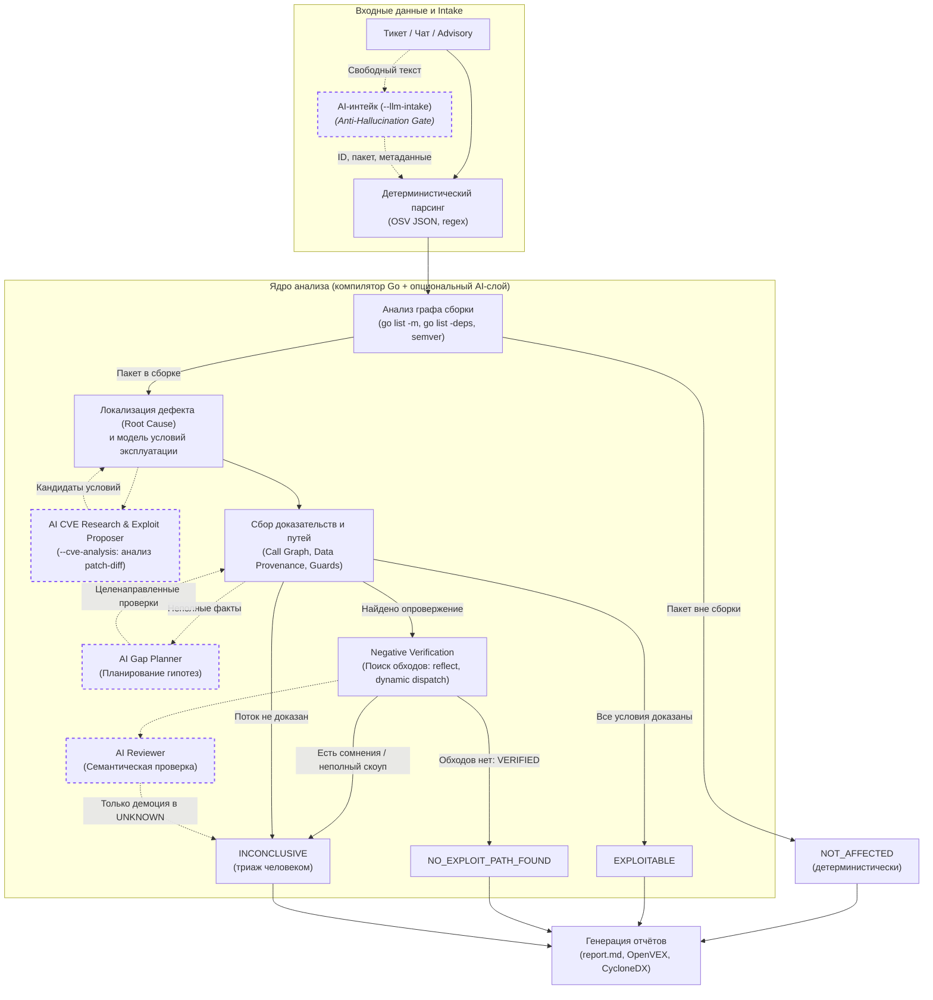

# Izyan (Vuln Analyzer)

Оригинальный репозиторий: [https://github.com/fedorovmv/izyan](https://github.com/fedorovmv/izyan)

**Izyan** (рус. *«Изъян»* — дефект, уязвимость) — статический анализатор эксплуатируемости уязвимостей в коде на **Go**.

Определяет реальную применимость конкретной advisory (CVE / GO / GHSA) к кодовой базе приложения, отсекает ложные срабатывания SCA-сканеров с математической строгостью компилятора Go и формирует готовое для AppSec и трекеров аудируемое обоснование.

---

## Ключевая ценность

Стандартные сканеры зависимостей (`govulncheck`, `trivy`, `snyk`) бьют тревогу при любом совпадении уязвимой библиотеки в `go.mod` или при наличии вызова функции в графе вызовов, не учитывая происхождение данных (константа или сеть) и наличие сдерживающих проверок (guards). Это порождает сотни часов бесполезного ручного триажа.

**Izyan автоматизирует анализ с гарантией безопасности**:
* **53% ложных алертов снимаются автоматически** (20 из 38 кейсов на эталонном [live-бенчмарке](eval/README.md));
* **35% signal-cleared**: безопасное снятие шумных алертов `govulncheck` (`REACHABLE` / `package-level`);
* **Строгий инвариант `false-safe = 0`**: ни одного ложно-безопасного вердикта. Отрицательный вердикт выносится только при математически строгом доказательстве невыполнимости условий атаки.

---

## Главные инварианты и система вердиктов

> **Отсутствие найденного пути эксплуатации не доказывает его отсутствие.**
> Система никогда не объявляет уязвимость безопасной только потому, что «ничего не нашла». Для безопасного вердикта требуется доказанный **фальсификатор (Falsifier)** обязательного условия атаки.

| Вердикт | Статус | Требования к доказательству |
|---|---|---|
| 🟢 **`NOT_AFFECTED`** | Безопасно | Пакет уязвимости детерминистически отсутствует в транзитивном графе сборки (`go list -deps`) или версия вне диапазона advisory. |
| 🟢 **`NO_EXPLOIT_PATH_FOUND`** | Не эксплуатируемо | Обязательное условие опровергнуто (`Falsifier`) и пройдена фаза `Negative Verification` (проверено отсутствие обходов через рефлексию, dynamic dispatch и теги сборки). |
| 🔴 **`EXPLOITABLE`** | Эксплуатируемо | Доказана полная цепочка: недоверенный внешний ввод достигает локуса дефекта без сдерживающих проверок. |
| 🟡 **`INCONCLUSIVE`** | Неопределенно | Неразрешимые динамические вызовы или зависимость от внешнего деплоя. **Честно передается на ручной триаж человеку**. |

---

## Конвейер анализа



---

## Быстрый старт

### Установка и сборка

```bash
# Установка через go install
go install github.com/fedorovmv/izyan/cmd/izyan@latest

# Либо сборка из исходников
git clone https://github.com/fedorovmv/izyan.git
cd izyan
go build -o izyan ./cmd/izyan
```

### Типовые сценарии использования
```bash
# 1. Анализ конкретной уязвимости из базы OSV по ID
izyan analyze --repo /path/to/project --vuln GO-2025-3595

# 2. Анализ по локальному файлу уязвимости OSV JSON (офлайн / закрытый контур)
izyan analyze --repo /path/to/project --vuln-file ./advisory.json

# 3. Анализ по задаче из трекера (JSON или текст) с авточекаутом релиза в worktree
izyan analyze --repo /path/to/project --ticket ./ticket.json --checkout-release

# 4. Анализ скопированного текста тикета или алерта сканера через stdin
pbpaste | izyan analyze --ticket - --repo /path/to/project --checkout-release

# 5. Анализ с автономным AI-исследованием механизма CVE и patch-diff
izyan analyze --repo /path/to/project --vuln GO-2026-6443 --cve-analysis assist

# 6. Полное сканирование всех зависимостей проекта
izyan scan --repo /path/to/project

# 7. Планирование и применение обновления с автопрогоном тестов
izyan remediate --repo /path/to/project --vuln GO-2025-3595 --apply --run-tests

# 8. Прогон тестового бенчмарка (38 реальных уязвимостей параллельно в 4 воркера)
izyan eval --corpus eval/corpus-real.json -j 4
```

### Входные форматы описания уязвимости

Izyan поддерживает гибкие варианты передачи входных данных (подробные примеры — в [CLI-справочнике](docs/cli.md#входные-форматы-описания-уязвимости)):
* **ID уязвимости (`--vuln <id>`)**: автоматическая загрузка из публичной базы OSV API (`api.osv.dev`).
* **Локальный файл уязвимости (`--vuln-file advisory.json`)**: стандартный формат [OSV JSON](https://ossf.github.io/osv-schema/) со списком затронутых пакетов, версий и символов — для изолированных сетей (air-gapped) и приватных отчётов безопасности / 0-day. ID уязвимости считывается из файла автоматически.
* **Файл задачи или произвольный текст (`--ticket ticket.json|ticket.txt|-`)**: структурированный JSON либо неструктурированный текст задачи (из Jira, GitLab, почты или сканера). Анализатор автоматически извлекает ID уязвимости, номер тикета, целевой компонент и релиз.

---

## Выходные артефакты

По результатам анализа в каталоге `.izyan/<case-id>/` (или `.vuln-analyzer/<case-id>/`) формируются:
* **`report.md`** (русский) и **`report.en.md`** (английский): структурированные отчёты с готовым разделом **`## Резюме`** для мгновенной вставки в задачу Jira/GitLab;
* **`openvex.json`** и **`cyclonedx.json`**: стандартизированные машиночитаемые документы VEX для интеграции с DevSecOps-пайплайнами;
* **`report.json`**: полный структурированный аудит-дамп досье и выполненных проверок.

---

## Документация и детальные руководства

Вся расширенная документация вынесена в специализированные разделы:

* 🛡️ **[Методология и гарантии безопасности (Security Deep Dive)](docs/how-it-works.md)** — **в первую очередь для службы информационной безопасности (AppSec)**: математическая строгость, почему одного `govulncheck` недостаточно, защитные предохранители (missing-call, constant payload, locus separation), AI Governance (детерминизм компилятора против LLM) и аудит.
* ⚙️ **[Справочник CLI и конфигурация](docs/cli.md)** — полное руководство по всем командам (`analyze`, `scan`, `remediate`, `eval`, `knowledge`), детальная таблица флагов, параметры сборки и настройка LLM-окружения (`.env`).
* 📊 **[Тестовый стенд и бенчмарк](eval/README.md)** — описание методологии оценки, baseline-таблица по 38 реальным уязвимостям, Decision Impact и воспроизводимость.
* 🏗️ **[Архитектура и модель данных](docs/architecture.md)** — устройство стейт-машины, входы/выходы и внутренняя организация для разработчиков.
* 📋 **[Канонический бэклог и статус](docs/dev/gap-analysis.md)** — открытые задачи, пробелы спека↔код и правила развития проекта.

---

## Участие в разработке и форки

Проект открыт для сообщества! Если вы форкаете или зеркалируете репозиторий (в том числе во внутренние корпоративные контуры), сохраняйте ссылку на оригинальный репозиторий: [https://github.com/fedorovmv/izyan](https://github.com/fedorovmv/izyan).

Все доработки, исправления дефектов и поддержка новых уязвимостей приветствуются обратно в апстрим через Pull Requests. Подробные правила, инварианты безопасности (`false-safe = 0`, no case-specific hardcode) и чеклист перед отправкой описаны в [**`CONTRIBUTING.md`**](CONTRIBUTING.md).

---

## Лицензия

MIT — см. [`LICENSE`](LICENSE).
