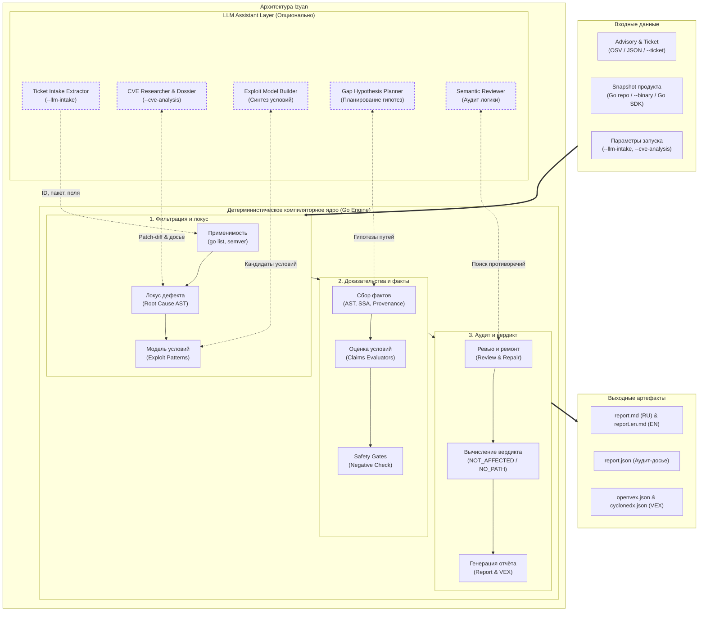
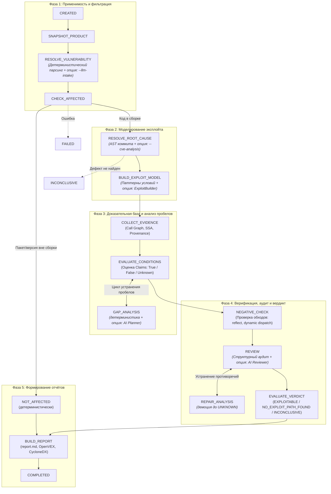

# Архитектура

Настоящий документ описывает архитектуру анализатора **Izyan (Vuln Analyzer)**: функциональные блоки, сквозную стейт-машину, подсистемы статического анализа, разграничение детерминистического компиляторного ядра и LLM-слоя, а также модель данных и подсистему отчетности.

Внутренняя механика реализации — [`dev/analysis-internals.md`](dev/analysis-internals.md); нормативная спека — [`dev/specs/governing-spec.md`](dev/specs/governing-spec.md).

---

## 1. Контекст системы



### Входы:
* **Advisory & Ticket**: документ уязвимости из OSV API (`--vuln`), локальный OSV JSON (`--vuln-file`) или обобщенный тикет трекера задач (`--ticket`);
* **Снимок продукта**: путь к Go-репозиторию (`--repo`), опционально собранный бинарник релиза (`--binary` для извлечения `build info`), версия тулчейна (`--release-go-version`), флаги сборки (`--build-tags`, `--goos`, `--goarch`);
* **Параметры управления**: режим AI-исследователя (`--cve-analysis`), семантическое извлечение тикета (`--llm-intake`), флаг fail-fast (`--strict-llm`), отключение LLM (`--deterministic-only`), экспертный базис локуса (`--non-locus-basis`, `--accept-locus-proposals`), разрешение выполнения бинарников репозитория (`--allow-exec`), лимиты памяти (`--mem-limit`).

---

## 2. Стейт-машина конвейера (Workflow State Machine)

Конвейер анализа реализован как строгая персистентная стейт-машина ([`internal/workflow`](../internal/workflow/)). Каждый переход между состояниями детерминирован и фиксируется на диске в сериализованном снимке `AnalysisCase`.



### Описание стадий стейт-машины

| Состояние | Отвечает на вопрос | Инструменты и методы | Выходные данные |
|---|---|---|---|
| **`SNAPSHOT_PRODUCT`** | «В каком окружении анализируется проект?» | Чтение `go.mod`, `go.sum`, `vendor/modules.txt`, git-коммита, определение локального или целевого Go SDK. | `domain.ProductSnapshot` |
| **`RESOLVE_VULNERABILITY`** | «Что задекларировано в advisory?» | Парсинг OSV JSON, нормализация semver-диапазонов, извлечение affected packages/symbols/aliases. | `domain.Vulnerability` |
| **`CHECK_AFFECTED`** | «Входит ли уязвимый код в сборку продукта?» | `go list -m all` (модуль и версия), `go list -deps` (наличие уязвимого пакета в графе сборки), semver-проверка. Если пакет отсутствует — немедленный переход к `NOT_AFFECTED`. | `domain.AffectedResult` |
| **`RESOLVE_ROOT_CAUSE`** | «Где конкретно в коде зависимости находится дефект?» | Загрузка `git diff` фиксирующего коммита, AST-поиск изменённых функций в исходниках зависимости (`FindSymbol`), локализация дефектного локуса (`DefectLocus`). При `--cve-analysis` — запуск автономного AI-исследования. | `domain.RootCauseModel` |
| **`BUILD_EXPLOIT_MODEL`** | «Какие обязательные условия нужны для эксплуатации?» | Классификация уязвимости по CWE и ключевым словам (`internal/exploit`), выбор декларативных паттернов условий (достижимость, внешний ввод, валидация, конфигурация). | `domain.ExploitModel` |
| **`COLLECT_EVIDENCE`** | «Что реально делает код продукта по отношению к дефекту?» | Запуск `govulncheck` (call graph), собственный компиляторный статический анализ (`internal/goanalysis`): поиск вызовов, трассировка происхождения данных (data provenance), поиск санитизаторов и гардов, сетевые слушатели. | `domain.EvidenceGraph` |
| **`EVALUATE_CONDITIONS`** | «Выполняются ли обязательные условия атаки?» | Детерминистические оценщики (`internal/evaluator`): оценка истинности условий (TRUE/FALSE/UNKNOWN) на основе собранных фактов. | Набор `domain.Claim` |
| **`GAP_ANALYSIS`** | «Можно ли устранить пробелы в доказательствах?» | Ограниченный цикл планирования гипотез: целенаправленные повторные трассировки аргументов вглубь дерева вызовов до фикспоинта или исчерпания бюджета. | Новые `Evidence` |
| **`NEGATIVE_CHECK`** | «Действительно ли условие невозможно (нет ли обходов)?» | Негативный верификатор (`Verifier`): проверка отсутствия динамических обходов (рефлексия `reflect`, небезопасные указатели `unsafe`, теги сборки `//go:build`, диспетчеризация через интерфейсы, missing-call гейт). | `NegativeVerification` (`VERIFIED` / `CONTRADICTED` / `INSUFFICIENT_SCOPE`) |
| **`REVIEW`** | «Нет ли структурных или логических противоречий?» | Структурные инварианты (запрет TRUE без evidence, запрет FALSE без NV) + опциональный семантический LLM-ревьюер. | `ReviewFindings` |
| **`REPAIR_ANALYSIS`** | «Как устранить замечания ревью?» | Безопасная демоция (понижение) сомнительных claims из FALSE в `UNKNOWN`. | Обновленные `Claim` |
| **`EVALUATE_VERDICT`** | «Каков итоговый статус эксплуатируемости?» | Детерминистическая матрица вычисления вердикта (`NOT_AFFECTED`, `NO_EXPLOIT_PATH_FOUND`, `EXPLOITABLE`, `INCONCLUSIVE`). | Итоговый вердикт |
| **`BUILD_REPORT`** | «Как представить результат человеку и системам?» | Генерация двуязычных отчетов по принципу Inverted Pyramid (`report.md`, `report.en.md`), формирование VEX-документов (`openvex.json`, `cyclonedx.json`). | Выходные файлы |

---

## 3. Разделение ролей: детерминистический код и LLM (AI Governance)

В анализаторе действует строгий принцип разграничения: **детерминистический код компилятора Go авторитетен; LLM является лишь вспомогательным генератором предложений (proposals)**.

```text
       ┌────────────────────────────────────────────────────────┐
       │                  LLM-слой (Ассистент)                  │
       │   • Семантический AI-интейк тикетов (--llm-intake)     │
       │   • Автономное CVE Research (Researcher + Dossier)     │
       │   • Предложение кандидатов локуса и Root Cause         │
       │   • Синтез кандидатов модели условий (Exploit Builder) │
       │   • Планирование гипотез в анализе пробелов (Planner)  │
       │   • Семантический ревью диффа и условий (Reviewer)     │
       └───────────────────────────┬────────────────────────────┘
                                   │ Структурированные предложения (JSON)
                                   ▼
       ┌────────────────────────────────────────────────────────┐
       │              Детерминистическое ядро Go                │
       │   • Go AST, SSA, types, semver, build graph            │
       │   • Обязательная компиляторная валидация предложений   │
       │   • Anti-Hallucination Gate (проверка исходного текста)│
       │   • Data Provenance, Call Graph, Negative Verification │
       │   • Исключительное право вынесения вердикта            │
       └────────────────────────────────────────────────────────┘
```

### Матрица ответственности по стадиям

| Стадия | Детерминистический код | Опциональный LLM-слой |
|---|---|---|
| `SNAPSHOT_PRODUCT` | 100% код: `go list`, парсинг модулей | — |
| `RESOLVE_VULNERABILITY`| 100% код: парсинг OSV JSON, regex-извлечение из тикета | **AI Ticket Intake (`--llm-intake`)**: семантическое извлечение ID, пакета и метаданных из свободного текста тикета/чата (с Anti-Hallucination Gate) |
| `CHECK_AFFECTED` | 100% код: сопоставление версий и `go list -deps` | — |
| `RESOLVE_ROOT_CAUSE` | `git diff` парсинг, `FindSymbol` в AST зависимости | **CVE Analysis (`Researcher`) & `RootCauseResolver`**: семантический разбор механизма CVE, формирование досье и Human Remainder |
| `BUILD_EXPLOIT_MODEL` | Классификатор CWE, библиотека паттернов | **AI Exploit Builder**: синтез и адаптация моделей условий эксплуатации |
| `COLLECT_EVIDENCE` | `govulncheck`, сбор доказательств AST/SSA, provenance | — |
| `EVALUATE_CONDITIONS` | Математические evaluators условий | — |
| `GAP_ANALYSIS` | Детерминистический планировщик гипотез | **AI Gap Planner & Fallback ClaimEvaluator**: целенаправленные гипотезы при исчерпании детерминистики |
| `NEGATIVE_CHECK` | Верификатор обходов (`Verifier`): reflect, dynamic markers | — |
| `REVIEW` | Структурные инварианты целостности | **AI Semantic Reviewer**: поиск логических ошибок (только демоция в `UNKNOWN`) |
| `REPAIR_ANALYSIS` | Демоция утверждений (только в сторону UNKNOWN) | — |
| `EVALUATE_VERDICT` | 100% код: детерминистическая логика вердикта | — |
| `BUILD_REPORT` | Рендеринг отчетов, локализация, генерация VEX | — |

### Правила AI-безопасности:
1. **Запрет усиления вердикта**: LLM не может сделать вердикт более «безопасным» или объявить уязвимость закрытой без прохождения компиляторной негативной верификации (`Negative Verification: VERIFIED`).
2. **Безопасное направление ослабления**: Рецензент LLM имеет право только **понизить** уверенность анализатора (демотировать утверждение из FALSE в `UNKNOWN`), если заметил неучтенный контекст.
3. **Режим `--deterministic-only`**: полностью отключает сетевые вызовы к LLM. Анализатор переключается на чистый компиляторный анализ без потери математической строгости.
4. **Режим `--strict-llm`**: fail-fast режим для CI/CD-тестирования AI-компонентов. При отказе API или превышении лимитов токенов кейс завершается со статусом `FAILED`, исключая скрытый fallback.

---

## 4. Подсистемы статического анализа

### 4.1. Управление локусом дефекта (Defect Locus & Basis Separation)
Стандартные базы уязвимостей связывают с CVE все функции, затронутые коммитом исправления (включая вспомогательный транспорт и диспетчеры). Из-за этого `govulncheck` бьет ложную тревогу `REACHABLE` при вызове обычного сервера.

Подсистема локуса ([`internal/rootcause`](../internal/rootcause/)):
* Вычисляет множество **дефектного локуса** $L \subseteq \text{DeclaredSymbols}$;
* Автоматически распознает функции транспорта и диспетчеризации как вспомогательные, формируя рекомендации об исключении (`ProposedNonLocus`);
* Применяет экспертные решения через базис (`--non-locus-basis`) или флаг `--accept-locus-proposals`;
* Формирует фальсификаторы:
  * `FalsifierLocusPackageAbsent` — дефектный пакет физически не скомпилирован;
  * `FalsifierLocusFunctionUnreached` — пакет присутствует в сборке, но уязвимая функция доказанно недостижима.

### 4.2. Анализ происхождения данных (Data Provenance) и Safety Gates
Подсистема Data Provenance ([`internal/goanalysis`](../internal/goanalysis/)) строит дерево происхождения аргументов функций:

* **Классы источников**: `OriginExternalUntrusted` (сеть, HTTP-запросы), `OriginConfiguration` (локальные файлы хоста), `OriginConstant` (литералы и константы Go), `OriginGenerated` (рандом, UUID), `OriginInternalService`, `OriginDatabase`.
* **Constant Payload Isolation**: при вызове парсеров входной payload отделяется от выходного приемника данных. Внутренняя рефлексия парсера по выходной структуре изолируется и не компрометирует константность входных байт (`FalsifierConstantOrGeneratedInput`).
* **Trusted Host Infrastructure**: чтение локальных конфигурационных файлов (`os.ReadFile`) классифицируется как доверенная среда развертывания (`FalsifierTrustedInfrastructure`).
* **Missing-Call Safety Gate**: защитный предохранитель `DepInvocationState`. Если уязвимость вызвана отсутствием обязательной проверки в коде библиотеки (GO-2020-0017 в `jwt-go`), отсутствие вызова проверки блокирует отрицательный вывод и сохраняет вердикт `INCONCLUSIVE`.

### 4.3. База знаний экосистемы (Knowledge Base)
Семантика публичных функций Go вынесена из исполняемого кода в декларативную JSON-базу знаний ([`internal/goanalysis/knowledge.json`](../internal/goanalysis/knowledge.json)):
* Описывает семантику листовых вызовов: источники данных (`os.Getenv`), проброс данных (passthrough: `io.ReadAll`, `bytes.NewBuffer`), санитизаторы, сетевые листенеры (`net.Listen`) и конфигурационные теги структур (`yaml`, `json`, `env`);
* Поддерживает бескомпиляционное расширение через оверлей `--knowledge <file>` для описания внутренних корпоративных библиотек продукта;
* Версионируется (`schema_version`, `data_version`) и хешируется (`digest=sha256`) для 100% воспроизводимости аудита.

---

## 5. Подсистема отчётности (Reporting Architecture)

Подсистема генерации отчётов ([`internal/report`](../internal/report/)) реализует принцип **Inverted Pyramid (Executive Summary First)**:

```text
┌────────────────────────────────────────────────────────┐
│ 1. Заголовок и баннер вердикта (Verdict Banner)        │
├────────────────────────────────────────────────────────┤
│ 2. Резюме для трекера (Tracker-Ready Rationale)         │  <-- Готовый текст для Jira / GitLab
├────────────────────────────────────────────────────────┤
│ 3. Рекомендации по устранению (Remediation Plan)       │  <-- Команды go get / go mod tidy
├────────────────────────────────────────────────────────┤
│ 4. Доказательная база (Evidence Dossier)               │  <-- Таблицы проверок и фактов
│    • Анализ применимости (Affected Analysis)           │
│    • Обязательные условия (Claims Status)              │
│    • Точки экспозиции и сетевые листенеры              │
│    • Статус локуса дефекта                             │
├────────────────────────────────────────────────────────┤
│ 5. Технический аудит и методология                     │  <-- Детерминированные vs LLM проверки
└────────────────────────────────────────────────────────┘
```

### Поддерживаемые форматы:
1. **`report.md` (RU)**: человекочитаемый отчет на русском языке с блоком `## Резюме` для вставки в задачу трекера без редактирования;
2. **`report.en.md` (EN)**: дублирующий отчет на английском языке для международных аудитов;
3. **`openvex.json`**: стандартизированный VEX-документ (Vulnerability Exploitability eXchange);
4. **`cyclonedx.json`**: VEX-расширение в формате CycloneDX;
5. **`report.json`**: полный машиночитаемый снимок досье со всеми доказательствами и ограничениями.

---

## 6. Масштабируемость и защита от OOM (Memory Management)

Для стабильной работы на масштабных кодовых базах со сложными транзитивными зависимостями (`grpc`, `go-getter`, `crypto`) реализованы механизмы контроля ресурсов:

1. **AST LRU-кэш пакетов**: синтаксические деревья зависимостей выгружаются из памяти (эвикция) при достижении квот (≤40 пакетов / ≤500 файлов), очищая связанные деревья типов;
2. **Свёртка fan-out вызовов (`classifyCache`)**: мемоизация классификации сайтов вызова предотвращает экспоненциальный комбинаторный взрыв графа вызовов (время анализа `yaml-file` снижено с 413с до 8с);
3. **Трассировочные бюджеты (`evalBudget`)**: попозиционные бюджеты выражений и лимиты сессий трассировки предотвращают зацикливание анализа;
4. **Watchdog оперативной памяти**: фоновый монитор памяти с порогом `--mem-limit` (по умолчанию 4GiB) выполняет принудительный возврат неиспользуемых спанов ОС (`debug.FreeOSMemory()`);
5. **Параллельный тестовый раннер**: утилита `eval` поддерживает параллельный пул воркеров (`-j <workers>`) с переиспользованием скомпилированных артефактов.

---

## 7. Модель данных (Domain Model)

Ключевые сущности ядра ([`internal/domain`](../internal/domain/)):

* **`AnalysisCase`**: агрегат всего анализа (метаданные уязвимости, снимок продукта, граф доказательств, список утверждений, история ревью, итоговый вердикт и аудит вызовов инструментов);
* **`EvidenceGraph`**: направленный граф доказательств, где каждый узел несет криптографический хеш факта, источник его происхождения (`provenance`) и уровень надежности;
* **`Claim`**: формальное утверждение об обязательности и истинности условия эксплуатации (`ConditionID`, `State`: TRUE / FALSE / UNKNOWN, `Falsifier`, результат `NegativeVerification`, список `Limitations`);
* **`Hypothesis`**: след работы планировщика `GAP_ANALYSIS` (какая гипотеза проверялась и к какому результату привела);
* **`ToolExecution`**: аудит вызова внешней утилиты (имя, аргументы, код возврата, длительность, SHA-256 вывода).

---

## 8. Безопасность окружения и изоляция

* **Exec Gate (`--allow-exec`)**: по умолчанию анализатор работает строго статически и не выполняет код из анализируемого репозитория. Запуск сборок и тестов (`go build`, `go test`) разрешен только при явном указании флага `--allow-exec`.
* **Аудируемость вызовов**: любой запуск дочерних процессов протоколируется в `tool_executions` со сверкой контрольных сумм при повторных прогонах.
* **Изоляция секретов**: файл `.env` с ключами доступа к LLM исключен из репозитория (`.gitignore`), а приватные пути хоста маскируются в отчетах.
